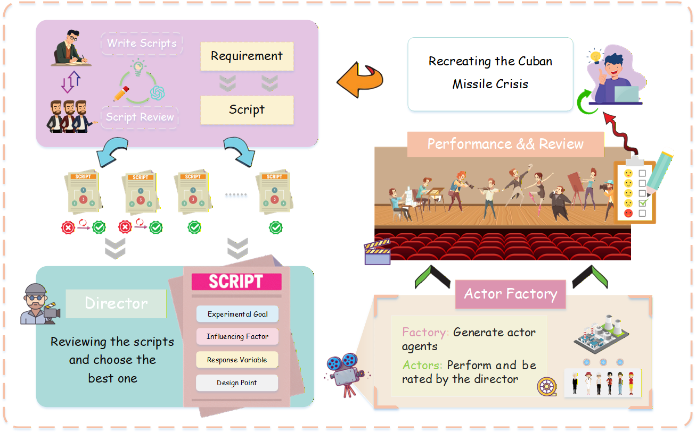

# FSTS: An Agentic Framework for Multi-Scenario Simulations Using LLMs

[](LICENSE)

**Language**: [English](README.md) | [中文](README_CN.md)

## 📖 Introduction

FSTS is an automated framework for designing, executing, and analyzing complex multi-agent simulations using Large Language Models (LLMs). Rooted in highly adaptable pipeline generation, FSTS supports wide-ranging scenarios—from simulating the Cuban Missile Crisis and international relations to analyzing the efficiency of smart city delivery ecosystems and digital government personnel.

FSTS can dynamically construct agents, assign complex behavioral traits and strategic parameters, conduct multi-group experiments, and autonomously evaluate the outcomes to generate insightful causal and behavioral analysis.

## 📊 FSTS Overview



## 🎯 Key Features

- **Automated Script Generation**: Translates natural language requirements into fully structured multi-agent experimental scenarios.
- **Dynamic Actor Modeling**: Readily instantiates tailored agents (e.g., Country A, Country B, Delivery Riders, Citizens, Merchants) with distinct variables, goals, and behavioral logic.
- **Specialized Multi-Agent Roles**:
  - **Generator Agents (AD, ED, RA, SS)**: Responsible for drafting actions, resolving environments, modeling responses, and simulating scenarios.
  - **Observer Agents (AD, ED, RA, VarObserver)**: Monitors state transitions, assesses relationships, and tracks customized response variables (like global tension index).
- **Flexible Event & Observation Pipeline**: Built-in `pipeline.py` integrates script generation, script finalization, and actor instantiation seamlessly.
- **LLM Agnostic**: Supports integration with leading LLMs such as GPT-4o, GPT-5-mini, DeepSeek-R1, and custom models.

## 📁 Project Structure

```text
FSTS/
├── models/                   # Core modeling and agent definitions
│   ├── agents/               # Multi-agent specialized roles
│   │   ├── LLMAgent.py       # Base LLM Agent wrapper
│   │   ├── ExampleActor/     # Generated actor examples (e.g., CountryAAgent, DeliveryRider)
│   │   ├── Generator/        # Scenario and context generator agents
│   │   │   ├── AD/           # Action/Decision generators
│   │   │   ├── ED/           # Environment/Event generators
│   │   │   ├── RA/           # Response/Reaction generators
│   │   │   └── SS/           # State/Sequence generators
│   │   └── Observer/         # Simulation state observers
│   │       ├── AD/           # Action/Decision observers
│   │       ├── ED/           # Environment/Variable observers
│   │       └── RA/           # Response/Reaction observers
├── tools/                    # Utility scripts and pipelines
│   ├── api_utils.py          # API interaction and LLM bindings
│   ├── logger.py             # Tagged logging system
│   ├── markdown_saver.py     # Simulation output rendering
│   └── pipeline.py           # Core execution logic & generation pipelines
├── docs/                     # Documentation and assets
│   └── framework.png         # System architecture diagram
├── config.py                 # System configuration
└── main.py                   # Main execution entrypoint
```

## 🏗️ System Architecture

FSTS relies on collaborative interactions between several structural components:

### Generators
- **Responsibility**: Dynamically design the variables, environmental conditions, and agent scripts.
- **Functions**: Generate experimental conditions, establish historical accuracy (e.g., Cuban Missile Crisis), and inject parameterized adjustments.

### Observers
- **Responsibility**: Track metrics like "global tension index," agent efficiency, and milestone transitions.
- **Functions**: Read scenario states, evaluate variable changes, log interaction histories, and compute dynamic similarities.

### Evaluation & Pipeline
- **Responsibility**: Direct the orchestration and evaluation of generated scripts.
- **Functions**: Parse requirements, spawn corresponding logic (`actor_generate`, `script_generate`), run step-by-step loops, and generate markdown reports.

## 🚀 Quick Start

### Requirements

- Python 3.10+
- Access to supported LLM APIs (OpenAI or local deployments like DeepSeek-R1 via Ollama/vLLM)
- Standard scientific packages

### Installation

```bash
# Clone the repository
git clone <repository-url>
cd FSTS

# Install dependencies
pip install -r requirements.txt
```

### Configuration

Modify `config.py` to set up your LLM endpoints and API keys. Open `main.py` and adjust the `MODEL_LIST` / `REQUIREMENT_LIST` to select your active model (e.g., `gpt-4o`) and prompt requirement.

### Running

To execute the main simulation pipeline:

```bash
python main.py
```

## 📊 Workflow

FSTS standard execution steps:

1. **Requirement Parsing**: Understands natural language requests (e.g., "Analyze efficiency of digital government workers" or "Simulate the Cuban Missile Crisis with extreme hostility").
2. **Pipeline Initialization**: `script_generate` creates the blueprint, `actor_generate` spins up customized agents like `CountryAAgent`.
3. **Multi-Agent Simulation**: Agents iterate over the scenario timesteps, utilizing `CommunicationManager` to interact.
4. **Observation & Logging**: Observer agents continually monitor and record specific variables to memory.
5. **Output Generation**: Results, causal events, and logs are distilled and documented using `markdown_saver`.

## 📝 About
This framework provides granular control over emergent behaviors from micro-level agent states, empowering broad simulation domains spanning digital infrastructure modeling, historical conflict reproduction, and complex sociotechnical systems.
